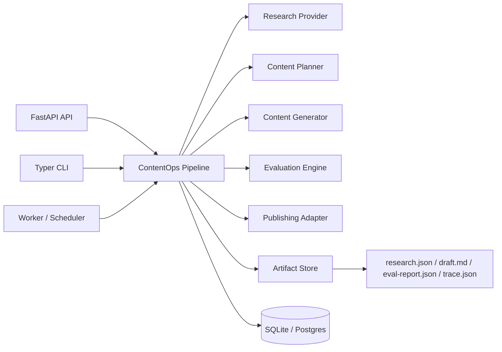

# Architecture

AI ContentOps Studio is organized around a run-oriented workflow. A run is the durable unit of
work for research, planning, drafting, evaluation, and publishing.



## Boundaries

- `apps/api` owns HTTP transport.
- `apps/cli` owns local operator workflows.
- `apps/worker` owns scheduled execution.
- `packages/core` owns domain models and orchestration.
- `packages/providers` owns external data/model adapters.
- `packages/evaluators` owns quality checks.
- `packages/publishing` owns output targets.
- `packages/observability` owns traces and run events.

## Run lifecycle

```text
created -> researching -> planning -> drafting -> evaluating -> needs_review
created -> researching -> planning -> drafting -> evaluating -> publishing -> published
failed
```

Publishing is only allowed after evaluation. In production, `needs_review` becomes the handoff
point for a dashboard review workflow.

## Production path

Local defaults:

- SQLite for run metadata
- filesystem for artifacts
- static site output directory

AWS-ready equivalents:

- RDS Postgres for run metadata
- S3 for artifacts
- EventBridge Scheduler for recurring runs
- ECS Fargate or Lambda for API/worker execution
- CloudWatch for logs and metrics
- Secrets Manager for provider credentials

## Stage 2 provider boundaries

Research providers:

- `local`: deterministic source packet for CI and offline demos
- `url`: fetches operator-supplied URLs and normalizes title, publisher, and summary
- `hybrid`: combines URL sources with local portfolio context

Generation providers:

- `template`: deterministic Markdown/HTML generation for repeatable tests
- `openai`: OpenAI Responses API generation, enabled only when credentials are configured

Publishing providers:

- `static`: writes generated content to a local static site directory
- `homepage`: writes posts into Zack's GitHub Pages homepage repository and updates the Writing grid
