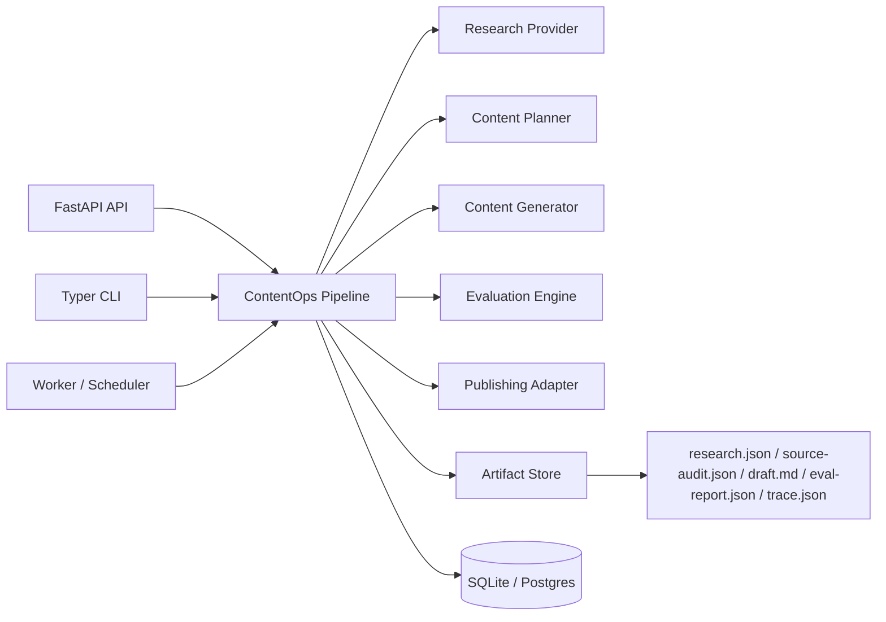

# Architecture

AI ContentOps Studio is organized around a run-oriented workflow. A run is the durable unit of
work for research, planning, drafting, evaluation, and publishing.



## Boundaries

- `apps/api` owns HTTP transport.
- `apps/cli` owns local operator workflows.
- `apps/worker` owns scheduled execution.
- `packages/core` owns domain models and orchestration.
- `packages/providers` owns external data/model adapters.
- `packages/evaluators` owns quality checks.
- `packages/publishing` owns output targets.
- `packages/observability` owns traces and run events.

## Run lifecycle

```text
created -> researching -> planning -> drafting -> evaluating -> needs_review
created -> researching -> planning -> drafting -> evaluating -> publishing -> published
failed
```

Publishing is only allowed after evaluation. In production, `needs_review` becomes the handoff
point for a dashboard review workflow.

## Review workflow

The review service lets an operator inspect artifacts from an existing run and publish that run
later:

- list artifact names for a run
- inspect an artifact manifest with size, media type, timestamp, and sha256 metadata
- read individual artifacts such as `research.json`, `draft.md`, or `eval-report.json`
- publish an existing run after evaluation, with an explicit force option for overrides
- preview file-level publish changes through `PublishPlan` before mutating targets

This separates generation from publication and creates a natural seam for a dashboard or approval
queue.

The FastAPI app includes a lightweight server-rendered dashboard at `/dashboard` so the project has
a usable review surface before a larger React dashboard is introduced.
The dashboard list and `/review-queue` endpoint use repository-level filtering, counting, and
pagination so operators can review larger queues without loading only the most recent local slice.

The dashboard and API expose run metrics derived from `trace.json`: total duration, per-step
durations, source count, source audit score, and publish readiness. This keeps observability tied
to persisted run artifacts rather than transient process logs.
The review layer also builds operational scorecards from run metadata, `trace.json`, and
`eval-report.json`. Scorecards expose quality pass/fail, latency SLO pass/fail, source-count SLO
pass/fail, warnings, and aggregate pass rates through the dashboard, CLI, and `/scorecards` API.
Cost reports estimate input and output tokens from persisted artifacts, compare the estimate
against `CONTENTOPS_TOKEN_BUDGET_PER_RUN`, and expose per-run plus aggregate budget pass rates.
Each drafting step writes `generation-receipt.json`, recording the generator provider, model,
retry attempts, fallback state, and provider usage tokens when available. Cost reports prefer
these provider usage tokens and only fall back to artifact-based estimates when usage is missing.
Each research step also writes `source-audit.json`, which grades every source with reviewer-facing
reasons and recommendations before the draft moves into planning.
The API also exposes `/ready`, and the CLI exposes `contentops doctor`, to report database,
artifact store, provider configuration, and operator-key readiness without exposing secrets.

Each run now persists `request.json`, which enables reproducible reruns through the CLI, API, and
dashboard without relying on operator memory or external logs.
The CLI exposes the same review queue, artifact manifest, source audit, scorecard, and cost-report
surfaces as the API, so operators can script review checks without scraping dashboard HTML.
Source review is a first-class review artifact. Operators can mark individual sources as included,
excluded, or still needing review through the API, CLI, or dashboard. Decisions are persisted to
`source-review.json` with reviewer, notes, and timestamp fields, and each source decision writes an
audit event so source curation is visible during later approval and publishing checks. Excluded
sources are removed from the effective source count used by scorecards, and any source explicitly
marked as still needing review blocks the source SLO and approval gate until it is resolved.

Run comparison is part of the review layer. It compares duration, source counts, source overlap,
publish readiness, and evaluation score deltas between a base run and a candidate run. This makes
regeneration and prompt/provider changes reviewable instead of subjective.

Approval is also part of the review layer. A generated run normally enters `needs_review`; an
operator can approve or reject it, and the decision is written to `approval.json`. Publishing a
reviewed run requires approval unless the operator uses an explicit force override. This gives the
system a real editorial control point instead of treating publish as a casual button click.
Approval also enforces operational governance: the run scorecard must pass and the estimated token
budget must remain within the configured per-run budget before an approval record is written.
The review queue supports batch approve and reject operations through the API, CLI, and dashboard;
each item returns its own result so one invalid run does not mask the rest of the batch. Worker
execution detail pages and `POST /job-executions/{id}/approve-runs` also approve all generated run
ids from one scheduled execution, giving operators a natural review unit for recurring calendars.
After approval, `POST /job-executions/{id}/publish-runs` applies the same publish gates per run and
returns individual success or failure records, so one blocked article does not hide successful
publishes from the same worker execution.
Successful publishes write `publish-receipt.json`, which links the public URL back to the run,
publisher, approval record, force flag, publish plan items, before/after file hashes, and rollback
hints. Existing publish targets are backed up under the run artifact directory before they are
overwritten.
The static-site and homepage publishers also upsert `contentops-publish-index.json` in the publish
target. The index is a machine-readable content catalog with run ids, public URLs, provider names,
timestamps, and evaluation scores, giving downstream automation a stable contract for homepage
aggregation, search indexing, RSS generation, or social promotion without scraping HTML.
The CLI command `contentops content-assets` consumes that index and writes `feed.xml` plus
`promotion-brief.md`, separating publishing from distribution so operators can review or automate
RSS, newsletter, search, and social workflows independently.
It also writes `content-distribution-manifest.json` with asset hashes, git repository metadata, and
suggested commit commands, making distribution files part of the same auditable site release loop
as generated posts and evaluation reports.
The same distribution workflow is available through `POST /content-assets` and the dashboard
Published Content section, with read endpoints for the RSS feed, promotion brief, and distribution
manifest.
Release evidence indexes generated `content-distribution-manifest.json` files in
`content_distribution.json`, including manifest digests, asset counts, and git status, so CI/CD
reviews can prove distribution assets were generated and are ready to commit or deploy.
The release gate includes a `content_distribution` check. It passes for empty sites, warns when
published content lacks distribution evidence or distribution files are still dirty in git, and
fails when recorded manifests do not include the expected feed, promotion brief, and manifest
assets.
Publish verification reads the current target files and compares their hashes against the publish
receipt, producing per-run `publish-verification.json` files for drift detection after deploys or
manual edits. Release evidence now rolls those run-level reports into `publish_verifications.json`,
and the release gate fails when published content no longer matches its recorded receipt.
When drift appears, `contentops publish-recovery-plan <run_id>` and
`GET /runs/{id}/publish-recovery-plan` produce `publish-recovery-plan.json` with file-level
restore, republish, or rollback guidance before any destructive recovery action is taken.
Rollback execution is explicit through `contentops run-publish-recovery` or
`POST /runs/{id}/publish-recovery`, and writes `publish-recovery-execution.json` alongside the
normal rollback audit event. Release evidence indexes recent recovery executions in
`publish_recovery_executions.json`, giving deployment reviewers a compact view of restored,
deleted, skipped, and failed recovery actions.
Incident reports sit above the review artifacts and aggregate run failures, scorecard warnings,
budget warnings, publish drift, and notification delivery failures into a single severity and
action-required flag. They are exposed through the dashboard, CLI, and API so operational triage
does not require manually opening every JSON artifact first.
The operations summary composes repository status counts with scorecards, cost reports, and
incident reports over a recent-run window. This gives operators one API/CLI/dashboard view for
queue depth, approved-but-unpublished work, failed runs, pass rates, average duration, incident
severity, and estimated token usage.
Operations trends bucket the same run, scorecard, cost, and incident evidence by calendar day.
They are exposed through `/ops-trends`, `contentops ops-trends`, and `/dashboard/ops-trends` so
operators can inspect publishing throughput, quality pass rate, budget posture, and incident
pressure without manually stitching together individual reports.
The operations brief is the decision layer above those signals. It combines provider health,
worker execution alerts, incidents, quality, budget, and review queue pressure into a headline,
top risks, and recommended actions through `/ops-brief`, `contentops ops-brief`,
`/dashboard/ops-brief`, and release evidence `ops_brief.json`.
Operators can also deliver the brief through `contentops ops-brief-notify` or
`POST /ops-brief/notify`. Each attempt writes `ops-brief-notification-log.json`, and release
evidence indexes those receipts in `ops_brief_deliveries.json` for auditability.
The operations console is the operator-facing rollup above the brief. It combines the operations
summary, daily brief, worker execution trends, worker alerts, release gate, retention report, and
recent archive receipts into one machine-readable report exposed through `/operations-console`,
`contentops operations-console`, `/dashboard/operations`, and release evidence
`operations_console.json`.
The deployment manifest reuses readiness checks and adds redacted runtime, security, operations,
and capability evidence. It is intended for release reviews, interview walkthroughs, and
automation that needs to understand deployment posture without exposing secrets.
Release readiness is the final gate above those operational surfaces. It combines readiness
checks, deployment capability status, open incidents, quality pass rates, budget pass rates, and
operator security into a `pass`, `warn`, or `fail` report with a machine-readable `can_release`
decision for CI, runbooks, or manual launch reviews.
Rollback uses that receipt to restore backed-up files or delete files created by the publish, then
records `publish-rollback.json` and a `rollback_publish` audit event.
Review actions append to `audit-log.json`, giving operators an immutable trail of approve, reject,
and publish transitions in addition to the latest run state.
The review service also exposes a global audit event view by scanning recent run audit logs and
sorting events by occurrence time. Operators can filter by run status, topic query, or action
without opening individual run artifact folders first.
The same review and publishing actions produce `notification-log.json` delivery receipts. By
default the local provider records skipped deliveries for auditability; when
`CONTENTOPS_NOTIFICATION_WEBHOOK_URL` is configured, events are posted to an external webhook and
success or failure is recorded without blocking the operator workflow.
Artifact retention reports scan recent run artifact directories, estimate file counts and storage
bytes, and identify runs older than a configured retention window. The report is intentionally
read-only so archive and cleanup decisions can be reviewed before any destructive operation.
Retention archives turn those candidates into a non-destructive zip plus JSON receipt through
`contentops retention-archive` and `POST /retention-archives`; release evidence indexes recent
archive receipts in `retention_archives.json`.
The release gate includes `retention_archive_governance`: it warns when old artifact candidates
exist without a non-dry-run archive receipt and fails when recorded archive S3 mirroring failed.
Published runs are projected into a content catalog exposed through `/content`, `contentops content`,
and the dashboard. The catalog combines run metadata, publish receipts, URLs, providers, publish
timestamps, and evaluation scores so the platform can be reviewed as a content inventory instead
of a collection of one-off artifacts.
Each run can also be exported as an evidence bundle through `/runs/{id}/bundle` or
`contentops export-run`. The zip contains a bundle manifest plus every run artifact, which makes
generated research, evaluation, traces, approval records, and publishing receipts portable for
portfolio reviews or incident handoffs.
URL research and search enrichment can use a persistent research cache. The cache stores normalized
`Source` extracts by canonical URL and TTL, reducing repeated network fetches during scheduled
worker reruns while keeping the source audit and research artifact contract unchanged.
Provider health is a first-class diagnostic surface. It reports research, generator, and publisher
status, credential posture, scheduled readiness, retry/cache settings, and provider-specific
warnings through `contentops provider-health`, `GET /provider-health`, the deployment manifest
health details, and release evidence `provider_health.json`.

```text
needs_review -> approved -> publishing -> published
needs_review -> rejected
```

## Worker jobs

The worker accepts YAML job files in either a single-job shape or a batch `jobs:` shape. Batch job
files are the production path for content calendars, scheduled digests, daily AI research
roundups, and GitHub repository project updates.

```yaml
name: daily-ai-roundup
jobs:
  - name: production-llm-systems
    topic: "AI engineering signals for production LLM systems"
    publish: true
    source_urls: []
```

The worker supports dry-run validation for deployment checks and JSON output for automation logs:

```powershell
contentops worker-jobs --json
contentops-worker run-pipeline pipelines/daily_ai_roundup.yaml --dry-run
contentops-worker run-pipeline pipelines/daily_ai_roundup.yaml --json
contentops-worker run-pipeline pipelines/project_repository_updates.yaml --dry-run --json
```

The worker job catalog scans `CONTENTOPS_PIPELINE_DIR` and exposes planned calendars through
`GET /worker-jobs`, `contentops worker-jobs`, and the dashboard. Operators can review job count,
publish intent, topics, tags, and invalid YAML before EventBridge or a manual run executes it.

Every worker invocation writes a job execution receipt under `artifact_root/job-executions` by
default. Receipts include execution id, dry-run flag, timestamps, duration, job metadata, run ids,
artifact directories, publish URLs, and per-job errors, giving EventBridge/ECS-triggered runs an
auditable artifact even when stdout logs are rotated.
Executed workers also write a JSON and Markdown delivery summary beside the receipt. The summary is
designed for operator review: it captures published items, distribution asset status, release
evidence status, failures, and recommended next actions, and release evidence indexes recent
summaries in `worker_delivery_summaries.json`. The worker can deliver the same summary to the
configured notification webhook and records the attempt in
`worker-delivery-summary-notification-log.json`.
For executions that publish content, the worker refreshes distribution assets from the publish
index before generating release evidence. The receipt records `content_assets_path`,
`content_assets_status`, `content_assets_files`, and `content_assets_error`, while the evidence
bundle indexes the generated `content-distribution-manifest.json`.
When a worker job creates a run, its workflow name, job name, tags, publish intent, and custom
metadata are copied into `request.json` and `workflow-context.json` inside the run artifact
directory. This lets reviewers open a run and understand which scheduled workflow produced it
without cross-referencing external logs.
The same receipt history is exposed through `GET /job-executions`, `GET /job-executions/{id}`,
`contentops job-executions`, `contentops job-execution`, and dashboard pages so operator review
does not depend on cloud log retention. The dashboard includes a content calendar view for
planned jobs plus a job execution detail view that links completed jobs back to generated runs,
source URLs, metadata, and recovery-plan JSON.
`GET /job-executions/{id}/summary` and `contentops job-execution-summary` compute generated run,
published run, handoff, release evidence, and action-required counts from the receipt so operators
can scan a scheduled execution before opening individual runs.
`contentops scheduled-workflow-summary` layers the recent worker receipts with the Operations
Console summary to produce review Markdown and PR metadata for GitHub Actions handoffs, including
release gate, retention gate, worker alert, content distribution assets, and queue pressure signals.
It can also write a scheduled review manifest that indexes the Markdown, PR metadata, Operations
Console snapshot, worker receipts, release evidence paths, content asset paths, homepage handoffs,
and published URLs committed by a manual draft PR workflow, including size, media type, SHA-256,
and missing-file metadata for each local artifact.
`contentops scheduled-workflow-verify` reloads that manifest and recomputes the metadata so CI can
fail review packages whose artifacts are missing or whose hashes have drifted.
`contentops scheduled-workflow-archive` builds on that check by producing a ZIP with the manifest,
verification report, package index, receipts, release evidence, content assets, and homepage
handoff files, giving scheduled automation a portable review artifact.
`GET /job-executions/trends`, `contentops job-execution-trends`, and the worker execution trends
dashboard aggregate those summaries by day for scheduled automation success rate, publish rate,
handoff success rate, and action-required counts.
Failed executions also expose a recovery plan through
`GET /job-executions/{id}/recovery-plan` and `contentops job-recovery-plan`. The plan rebuilds the
failed jobs as a YAML-compatible content calendar while preserving topic, source URLs, publish
intent, tags, and metadata for controlled reruns. Operators can execute the same plan immediately
through `POST /job-executions/{id}/recovery-runs`, `contentops job-recovery-plan <id> --run`, or
the dashboard detail page; the new recovery execution is recorded as a normal worker receipt with
`recovery_source_execution_id`, `recovery_actor`, and `recovery_notes` metadata for traceability.
Recovery plans include `runnable`, `blocked_reason`, and `source_dry_run`, and dry-run receipts are
blocked from recovery execution because they are schedule previews rather than failed production
runs.

## Production path

Local defaults:

- SQLite for run metadata
- filesystem for artifacts
- static site output directory

AWS-ready equivalents:

- RDS Postgres for run metadata
- S3 for artifacts through optional S3 mirroring
- EventBridge Scheduler for recurring runs
- ECS Fargate or Lambda for API/worker execution
- CloudWatch for logs and metrics
- Secrets Manager for provider credentials

The S3 artifact store keeps the local filesystem copy authoritative and mirrors each write to
S3. Every mirror attempt appends `s3-mirror-log.json` beside the run artifacts with provider,
bucket, key, content type, status, error, and timestamp fields. This makes object-level storage
state auditable even when cloud logs have rotated or a worker fails midway through a run.

The Terraform baseline now provisions an RDS Postgres metadata database and writes a
`postgresql+psycopg://` `CONTENTOPS_DATABASE_URL` into Secrets Manager for ECS task injection.
This keeps local SQLite useful for development while proving the production metadata path has a
real cloud target.

It also provisions an EventBridge Scheduler rule for the worker task. The schedule is disabled by
default so deployments can validate networking, RDS connectivity, and publishing configuration
before recurring content generation is turned on.
The same Terraform layer provisions disabled-by-default schedules for worker alerts, operations
brief delivery, release gates, and retention archive creation, keeping operational automation
explicit until the artifact bucket and metadata database are ready.

## Stage 2 provider boundaries

Research providers:

- `local`: deterministic source packet for CI and offline demos
- `url`: fetches operator-supplied URLs and normalizes title, publisher, and summary
- `hybrid`: combines URL sources with local portfolio context
- `github`: collects GitHub repository metadata, README text, open issues, and open pull requests
- `feed`: discovers candidate sources from configured RSS/Atom feeds or Atom search endpoints
- `search`: discovers candidate sources from a Brave-compatible web search API and enriches
  result URLs with fetched page metadata
- `discovery`: combines feed discovery, operator URLs, and local portfolio context

The search provider is the credentialed production path for open-web discovery. The GitHub
provider is the repository evidence path for launch posts, project writeups, and open-source
activity summaries. The discovery provider is the low-cost recurring path for curated feeds and
operator URLs. These providers let the worker start from a topic, retrieve current entries or
repository activity, rank or normalize the evidence, deduplicate canonical URLs, and persist the
discovered sources into `research.json`.
Research packets also include provider metadata. The search provider records planned query
variants, selected URLs, result counts, and enrichment settings. The GitHub provider records
requested repositories plus per-repository project intelligence such as README evidence, activity
signals, source count, and failed fetch state. This keeps scheduled research explainable without
requiring operators to reconstruct provider behavior from logs.
Each normalized source includes source type, authority score, topic relevance score, canonical URL,
and duplicate count. `source-audit.json` uses those fields to explain whether the evidence is
strong enough for publication or needs human review.
Network-backed research providers share a bounded retry policy for transient timeouts,
connection errors, `429`, and `5xx` responses so scheduled workers degrade gracefully when an
upstream source is briefly unavailable.

Generation providers:

- `template`: deterministic Markdown/HTML generation for repeatable tests
- `openai`: OpenAI Responses API generation, enabled only when credentials are configured;
  transient provider failures use bounded retry/backoff, and exhausted failures can fall back to
  the deterministic template generator for reviewable scheduled runs

Publishing providers:

- `static`: writes generated content to a local static site directory
- `homepage`: writes posts into Zack's GitHub Pages homepage repository, updates the Writing grid,
  records git branch/dirty state in the publish plan, and emits suggested `git add`, `commit`, and
  `push` commands for the homepage repo handoff. `contentops homepage-handoff` and
  `/runs/{id}/homepage-handoff` package the plan, generated article, eval report, and command list
  into a reviewable zip before the homepage repository is committed. Release evidence indexes
  generated homepage handoff zips in `homepage_handoffs.json` with path, size, digest, and update
  time, keeping personal-site publish packages tied to the deployment evidence trail.
  Release evidence also indexes source review decisions in `source_reviews.json`, summarizing
  include, exclude, and pending-review decisions by run so source curation is part of the final
  deployment evidence bundle. Any pending source review decision marks release evidence as not
  releasable and fails the release gate's `source_review_governance` check.
