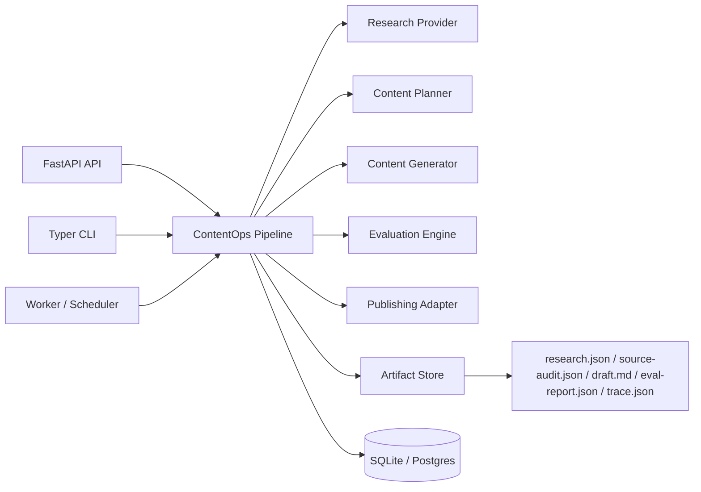

# Architecture

AI ContentOps Studio is organized around a run-oriented workflow. A run is the durable unit of
work for research, planning, drafting, evaluation, and publishing.



## Boundaries

- `apps/api` owns HTTP transport.
- `apps/cli` owns local operator workflows.
- `apps/worker` owns scheduled execution.
- `packages/core` owns domain models and orchestration.
- `packages/providers` owns external data/model adapters.
- `packages/evaluators` owns quality checks.
- `packages/publishing` owns output targets.
- `packages/observability` owns traces and run events.

## Run lifecycle

```text
created -> researching -> planning -> drafting -> evaluating -> needs_review
created -> researching -> planning -> drafting -> evaluating -> publishing -> published
failed
```

Publishing is only allowed after evaluation. In production, `needs_review` becomes the handoff
point for a dashboard review workflow.

## Review workflow

The review service lets an operator inspect artifacts from an existing run and publish that run
later:

- list artifact names for a run
- inspect an artifact manifest with size, media type, timestamp, and sha256 metadata
- read individual artifacts such as `research.json`, `draft.md`, or `eval-report.json`
- publish an existing run after evaluation, with an explicit force option for overrides
- preview file-level publish changes through `PublishPlan` before mutating targets

This separates generation from publication and creates a natural seam for a dashboard or approval
queue.

The FastAPI app includes a lightweight server-rendered dashboard at `/dashboard` so the project has
a usable review surface before a larger React dashboard is introduced.
The dashboard list and `/review-queue` endpoint use repository-level filtering, counting, and
pagination so operators can review larger queues without loading only the most recent local slice.

The dashboard and API expose run metrics derived from `trace.json`: total duration, per-step
durations, source count, source audit score, and publish readiness. This keeps observability tied
to persisted run artifacts rather than transient process logs.
Each research step also writes `source-audit.json`, which grades every source with reviewer-facing
reasons and recommendations before the draft moves into planning.
The API also exposes `/ready`, and the CLI exposes `contentops doctor`, to report database,
artifact store, provider configuration, and operator-key readiness without exposing secrets.

Each run now persists `request.json`, which enables reproducible reruns through the CLI, API, and
dashboard without relying on operator memory or external logs.
The CLI exposes the same review queue, artifact manifest, and source audit surfaces as the API, so
operators can script review checks without scraping dashboard HTML.

Run comparison is part of the review layer. It compares duration, source counts, source overlap,
publish readiness, and evaluation score deltas between a base run and a candidate run. This makes
regeneration and prompt/provider changes reviewable instead of subjective.

Approval is also part of the review layer. A generated run normally enters `needs_review`; an
operator can approve or reject it, and the decision is written to `approval.json`. Publishing a
reviewed run requires approval unless the operator uses an explicit force override. This gives the
system a real editorial control point instead of treating publish as a casual button click.
The review queue supports batch approve and reject operations through the API, CLI, and dashboard;
each item returns its own result so one invalid run does not mask the rest of the batch.
Successful publishes write `publish-receipt.json`, which links the public URL back to the run,
publisher, approval record, force flag, publish plan items, before/after file hashes, and rollback
hints. Existing publish targets are backed up under the run artifact directory before they are
overwritten.
Rollback uses that receipt to restore backed-up files or delete files created by the publish, then
records `publish-rollback.json` and a `rollback_publish` audit event.
Review actions append to `audit-log.json`, giving operators an immutable trail of approve, reject,
and publish transitions in addition to the latest run state.

```text
needs_review -> approved -> publishing -> published
needs_review -> rejected
```

## Worker jobs

The worker accepts YAML job files in either a single-job shape or a batch `jobs:` shape. Batch job
files are the production path for content calendars, scheduled digests, and daily AI research
roundups.

```yaml
name: daily-ai-roundup
jobs:
  - name: production-llm-systems
    topic: "AI engineering signals for production LLM systems"
    publish: true
    source_urls: []
```

The worker supports dry-run validation for deployment checks and JSON output for automation logs:

```powershell
contentops-worker run-pipeline pipelines/daily_ai_roundup.yaml --dry-run
contentops-worker run-pipeline pipelines/daily_ai_roundup.yaml --json
```

Every worker invocation writes a job execution receipt under `artifact_root/job-executions` by
default. Receipts include execution id, dry-run flag, timestamps, duration, job metadata, run ids,
artifact directories, publish URLs, and per-job errors, giving EventBridge/ECS-triggered runs an
auditable artifact even when stdout logs are rotated.

## Production path

Local defaults:

- SQLite for run metadata
- filesystem for artifacts
- static site output directory

AWS-ready equivalents:

- RDS Postgres for run metadata
- S3 for artifacts through optional S3 mirroring
- EventBridge Scheduler for recurring runs
- ECS Fargate or Lambda for API/worker execution
- CloudWatch for logs and metrics
- Secrets Manager for provider credentials

The Terraform baseline now provisions an RDS Postgres metadata database and writes a
`postgresql+psycopg://` `CONTENTOPS_DATABASE_URL` into Secrets Manager for ECS task injection.
This keeps local SQLite useful for development while proving the production metadata path has a
real cloud target.

It also provisions an EventBridge Scheduler rule for the worker task. The schedule is disabled by
default so deployments can validate networking, RDS connectivity, and publishing configuration
before recurring content generation is turned on.

## Stage 2 provider boundaries

Research providers:

- `local`: deterministic source packet for CI and offline demos
- `url`: fetches operator-supplied URLs and normalizes title, publisher, and summary
- `hybrid`: combines URL sources with local portfolio context
- `feed`: discovers candidate sources from configured RSS/Atom feeds or Atom search endpoints
- `search`: discovers candidate sources from a Brave-compatible web search API and enriches
  result URLs with fetched page metadata
- `discovery`: combines feed discovery, operator URLs, and local portfolio context

The search provider is the credentialed production path for open-web discovery. The discovery
provider is the low-cost recurring path for curated feeds and operator URLs. Both let the worker
start from a topic, retrieve current entries, rank them by topic relevance and AI engineering
keywords, enrich reachable search results with page content, deduplicate canonical URLs, and
persist the discovered sources into `research.json`.
Network-backed research providers share a bounded retry policy for transient timeouts,
connection errors, `429`, and `5xx` responses so scheduled workers degrade gracefully when an
upstream source is briefly unavailable.

Generation providers:

- `template`: deterministic Markdown/HTML generation for repeatable tests
- `openai`: OpenAI Responses API generation, enabled only when credentials are configured;
  transient provider failures use bounded retry/backoff, and exhausted failures can fall back to
  the deterministic template generator for reviewable scheduled runs

Publishing providers:

- `static`: writes generated content to a local static site directory
- `homepage`: writes posts into Zack's GitHub Pages homepage repository and updates the Writing grid
